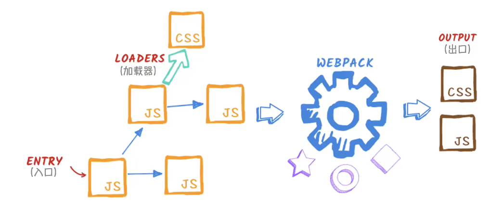

# miya-vue2
- 这个项目是为了学习vue原理创建的

### 1. Vue.js简介

### webpack
1. 为什么使用webpack？ 
    - 资源引入顺序问题
    - window全局污染问题
    - 模块  
       a. commonJS(nodejs模块化方案)   
       b. requireJS  
       c. ES6模块（存在浏览器兼容问题，大部分浏览器不支持）
    - webpack ——> 前端工程化解决方案

2. 安装：
```bash
    # 安装在全局
    npm install webpack webpack-cli --gloable
    # 初始化项目配置信息package.json
    npm init -y
    # 安装在当前目录
    npm install webpack webpck-cli --save-dev
    # 打包
    webpack
    # 查看打包细节
    webpack --stats detailed
    # 卸载全局webpack
    webpack uninstall webpack webpack-cli --gloable
    # 执行 webpck，报错： no such file or directory
    webpack
    # 寻址，正常打包，怎么自定义呢？
    npx webpack

```
3. 自定义webpack配置

```bash
    # 查看webpack命令 
    npx webpack --help
    # 配置入口和环境，命令不方便保存？
    npx webpack --entry ./src/index.js --mode production

    # 创建一个webpack配置文件(webpack.config.js)
```
3. webpack 配置文件（entry， output， mode）
```javascript
    const path = require('path')
    module.exports = {
        // 入口
        entry: './src/index.js',
        // 出口
        output: {
            filename:'bundle.js'，
            path: path.resolve(__dirname, './dist')
        },

        mode: 'none'
    }
    // npx webpack
    // 手动引入非常麻烦，如何自动引入资源？
```
4. 自动引入资源(webpack 插件)
    - 什么是webpack 插件？    
        webpack处理流程：
        
    - webpack plugin   
        [官方地址] ('https://webpack.js.org/plugins/')   
        a. Community 社区实现的插件     
        b. Webpack 内置官方插件                  
        c. Webpack Contrib 第三方插件
    - 使用 webpack-html-plugin 实现资源自动引入

```bash
    # 1. 安装
    npm install html-webpack-plugin --save-dev
    # 2. 配置webpack-html-plugin插件
    
``` 
```javascript
    const path = require('path')
    const HtmlWebpackPlugin = require('html-webpack-plugin')

    module.exports = {
        // 入口
        entry: './src/index.js',
        // 出口
        output: {
            filename:'bundle.js'，
            path: path.resolve(__dirname, './dist')，
            clean: true //清理历史dist目录
        },

        mode: 'none',
        // 插件配置
        plugins: [
            // dist目录中生成html文件，引入打包好的bundle.js
            new HtmlWebpackPlugin({
                template: './index.html',
                filename: 'app.html'， // 输出的文件名
                inject: 'body', // script标签生成位置
            })
        ]

    }

    // 问题1： 如何清理dist ？  clean: true
    // 问题2： 打包完成之后怎么实现在浏览器中自动预览？  
```
5. 搭建开发环境
    - mode: development（编译模式设置为开发）
    - source-map （精准定位代码位置）
    - webpack --watch （自动监测文件变化，重新编译）
    - webpack-dev-server
```bash
    npx webpack
    # 打包的js无法准去定位 ？ source-map

    # 实时监测文件变化
    npx webpack --watch

    # 安装 webpack-dev-server
    npm install webpack-dev-server -D

    # 启动服务， 打包的文件输出在内存中
    npx webpack-dev-server 
```
```javascript
    const path = require('path')
    const HtmlWebpackPlugin = require('html-webpack-plugin')

    module.exports = {
        // 入口
        entry: './src/index.js',
        // 出口
        output: {
            filename:'bundle.js'，
            path: path.resolve(__dirname, './dist')，
            clean: true //清理历史dist目录
        },

        mode: 'development',

        devtool: 'inline-source-map',

        // 插件配置
        plugins: [
            // dist目录中生成html文件，引入打包好的bundle.js
            new HtmlWebpackPlugin({
                template: './index.html',
                filename: 'app.html'， // 输出的文件名
                inject: 'body', // script标签生成位置
            })
        ],

        devServer: {
            static: './dist' //dev-server 指向的物理路径
        }

    }  

    // 问题：webpack针对其他类型的文件是怎么处理的呢？
```
6. 资源模块
    - (1) asset/resource (发送一个单独的文件，并导出url)

    ```javascript   
    const path = require('path')
    const HtmlWebpackPlugin = require('html-webpack-plugin')

    module.exports = {
        // 入口
        entry: './src/index.js',
        // 出口
        output: {
            filename:'bundle.js'，
            path: path.resolve(__dirname, './dist')，
            clean: true //清理历史dist目录

            // 指定资源模块路径及文件名
            assetModuleFilename: 'image/[contenthash][ext]'
        },

        mode: 'development',

        devtool: 'inline-source-map',

        // 插件配置
        plugins: [
            // dist目录中生成html文件，引入打包好的bundle.js
            new HtmlWebpackPlugin({
                template: './index.html',
                filename: 'app.html'， // 输出的文件名
                inject: 'body', // script标签生成位置
            })
        ],

        devServer: {
            static: './dist' //dev-server 指向的物理路径
        },
        
        module: {
            rules: [
                {
                    test: /\.png$/,
                    type: 'asset/resource',
                    generator: {
                        filename: 'imgages/[contenthash][ext]' // 优先级高于output中的配置
                    }
                }
            ]
        }

    }   
    // npx webpack-dev-server --open 
    ```
    - (2) asser/inline （导出资源的data url） 

    ```javascript  

        rules: [
                {
                    test: /\.png$/,
                    type: 'asset/resource',
                    generator: {
                        filename: 'imgages/[contenthash][ext]' // 优先级高于output中的配置
                    }
                },
                {
                    test: /\.svg$/,
                    type: 'asset/inline'
                }
            ]   
    ``` 
    - (3) asset/source （导出资源的源代码）
    ```javascript  

        rules: [
                {
                    test: /\.png$/,
                    type: 'asset/resource',
                    generator: {
                        filename: 'imgages/[contenthash][ext]' // 优先级高于output中的配置
                    }
                },
                {
                    test: /\.svg$/,
                    type: 'asset/inline'
                },
                {
                    type: /\.text$/,
                    type: 'asset/source'
                }
            ]   
    ``` 

    - (4) asset （导出一个data url和发送一个单独的文件之间自动选择）

    ```javascript  

        rules: [
                {
                    test: /\.png$/,
                    type: 'asset/resource',
                    generator: {
                        filename: 'imgages/[contenthash][ext]' // 优先级高于output中的配置
                    }
                },
                {
                    test: /\.svg$/,
                    type: 'asset/inline'
                },
                {
                    type: /\.text$/,
                    type: 'asset/source'
                },
                {
                    type: /\.jpg$/,
                    type: 'asset',
                    parser: { 
                        dataUrlCondition: {
                            maxSize: 4 * 1024 * 1024  // 4M,大于4M生成单独文件，并导出URL，否则导出 base64 url
                        }
                    }, // 默认8K
                }
            ]   
        // 通过loader：解析其他类型文件， 引入其他类型的文件
    ``` 
7. loader
    - 加载css模块 css-loader
    ```bash 
        npm install --save-dev css-loader style-loader

        npm install --sava-dev less-loader

        npm install mini-css-extract-plugin --save-dev
    ```

    ```javascript

        rules: [
                {
                    test: /\.png$/,
                    type: 'asset/resource',
                    generator: {
                        filename: 'imgages/[contenthash][ext]' // 优先级高于output中的配置
                    }
                },
                {
                    test: /\.svg$/,
                    type: 'asset/inline'
                },
                {
                    test: /\.text$/,
                    type: 'asset/source'
                },
                {
                    test: /\.(css|less)$/,
                    //use: ['style-loader','css-loader','less-loader'] // css-loader
                    // style-loader 将打包好的 css加载到html的head标签中
                    // 注意顺序从后往前
                    use: [MiniCssExtractPlugin.loader,'css-loader','less-loader']
                }
            ]   
            // 怎么把style中的内容通过外部链接的方式引入呢？

            const MiniCssExtractPlugin = require('mini-css-extract-plugin')
            plugins: [
            // dist目录中生成html文件，引入打包好的bundle.js
            new HtmlWebpackPlugin({
                template: './index.html',
                filename: 'app.html'， // 输出的文件名
                inject: 'body', // script标签生成位置
            }),

            new MiniCssExtractPlugin()
            ],                                                      
    ``` 


